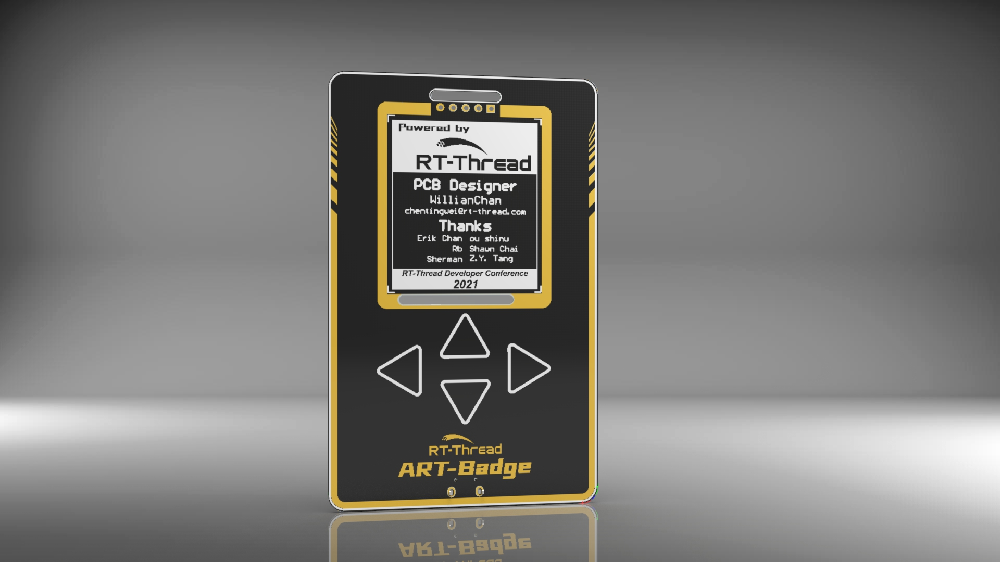

# ART-Badge 应用开发

应用开发是 PersimWear OS（湃心 OS）最上层软件开发过程，目前开发方式采用 JS 小程序的模式。

底层基于 JS 应用程序框架，框架中提供了众多组件支持，保证了上层应用开发的基础能力。

## 参考资料

- [APP 开发流程](docs/APP_开发流程.md)

- [Launcher 开发流程](docs/Launcher_开发流程.md)

- [老版本胸牌指南](docs/老版本胸牌指南.md)

- [恢复出厂固件方法](docs/恢复出厂固件方法.md)

- [ART-Badge JS 应用框架 API 手册](docs/JS_应用框架_API/ART-Badge_JS_应用框架_API_手册.md)

