# APP 开发流程

## 基于现成 APP 模板开发

### 安装柿饼设计器

双击 `PersimmonUI_1.4.20201229.exe` 柿饼设计器安装程序按步骤安装即可。


亦可解压免安装版本 `PersimmonUI_1.4.20201229.zip` 直接双击 `PersimmonUI.exe` 打开使用，我们推荐大家安装使用。

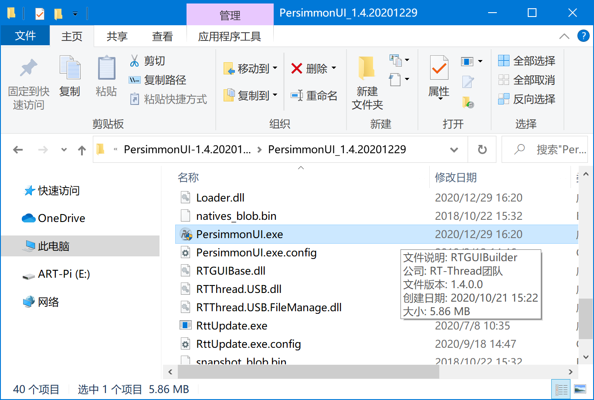

### 设计器导入 APP 模板工程

`ART_Badge_template` 为 APP 模板工程，可基于它进行开发。

打开设计器，文件 -> 打开，选择 `ART_Badge_template` 文件夹中的柿饼工程 `ART_Badge_template.rtprj` 打开，即可进行开发。

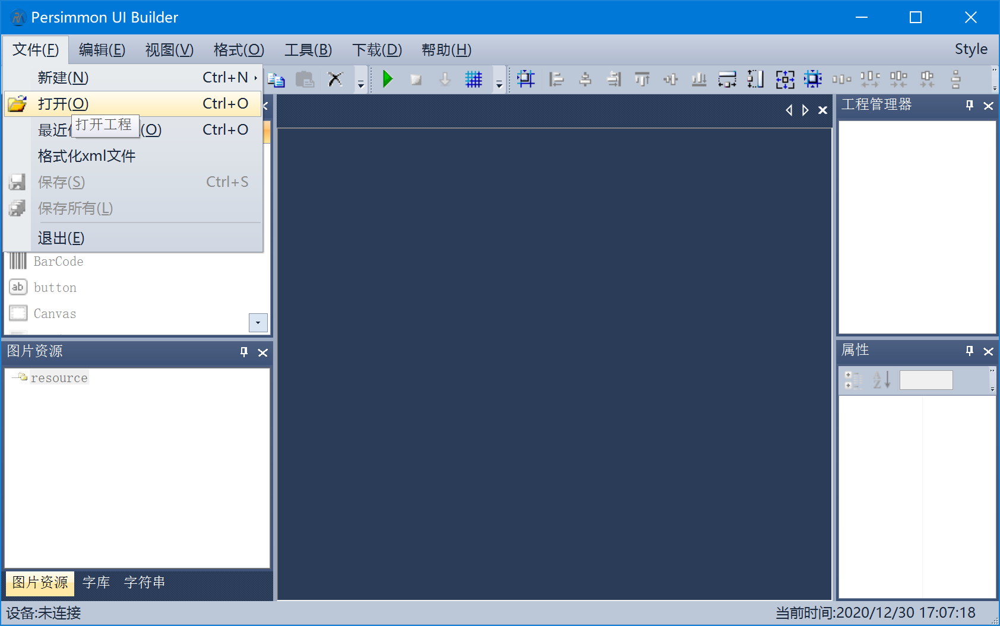

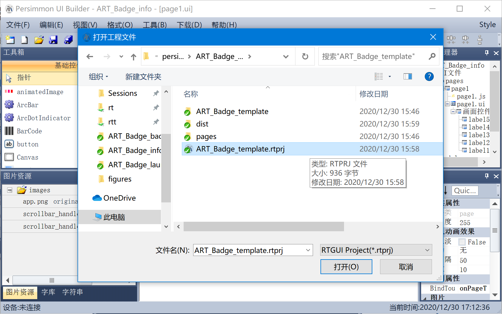

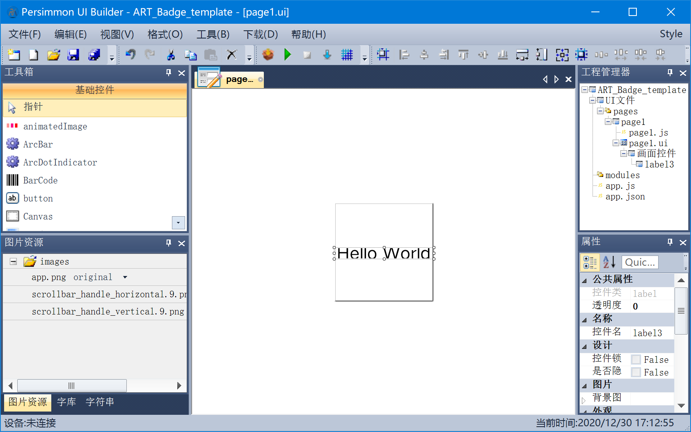


## APP 下载安装方式

将 ART-Badge 插上电脑，在工程管理器中点击右键打开工程属性。


在下载模式中，选择 `自定义下载`，并勾选 `下载前打包`，填写如下命令，注意 `comXX` 是你自己的端口号，打开设备管理器如实填写即可，1000000 是波特率（需要注意，如果从未更新过系统固件，那么波特率为 230400，更新了最新固件后，波特率被修改成 1000000）：

```
udb connect comXX 1000000
udb install dist/app.prc
```

最后应用并关闭即可。

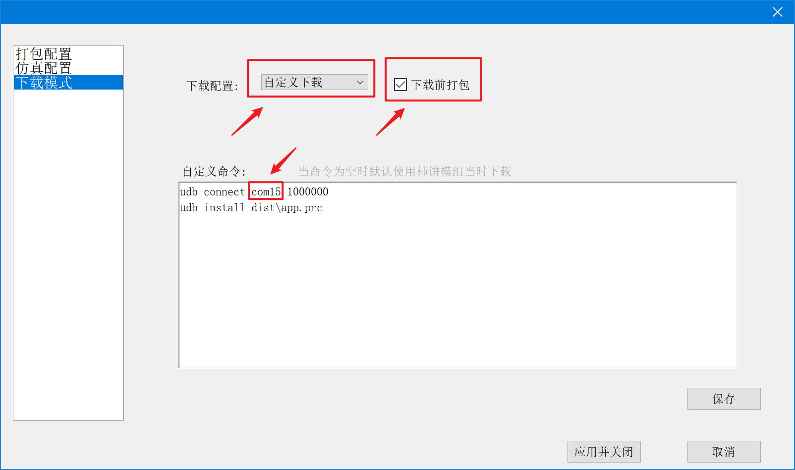

回到设计器页面，点击下载，可看到下载进度条以及 `installing app` 字眼，等候片刻 APP 安装，最后弹出 `请按任意键继续. . .`，表示 APP 下载并安装完毕。

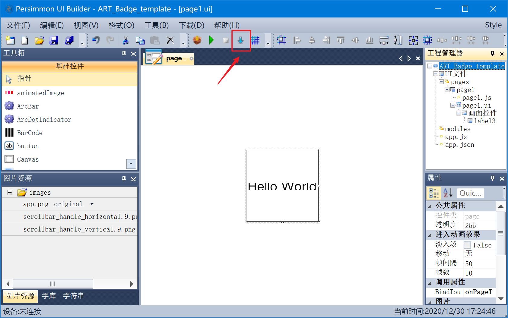

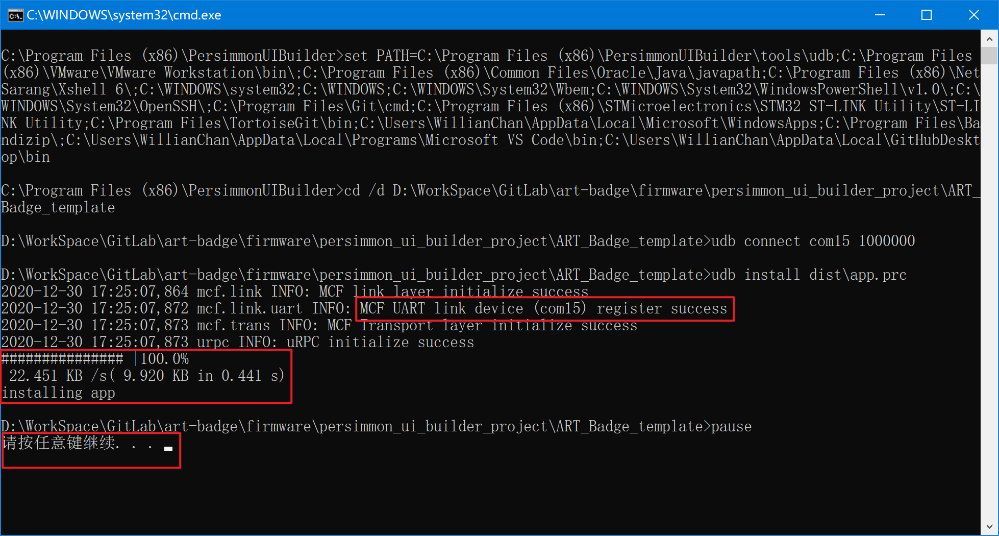

复位 ART-Badge 后，在 ART-Badge 主页下拉进入应用列表，即可看到刚刚下载进去的 APP 了，右键进入 APP ，左键推出 APP 并返回应用列表（下图中红色的线是屏幕上有层保护膜，比并非显示有红线）。

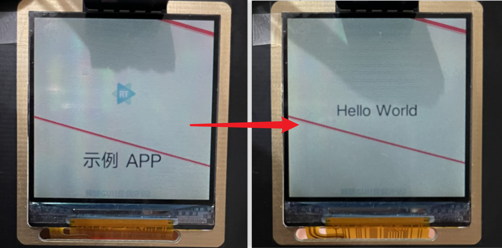

## APP 自动运行

在下载模式中，填写如下命令即可，点击下载就可以自动运行 APP 了：

```
udb connect com15 1000000
udb install dist/app.prc /user/download com.example.ART-Badge_template
```

注意，这里的 `com.example.ART-Badge_template` 是 APP 的 ID，可在 `app.json` 中查看并修改。APP ID 需要确保在 `PersimWear OS` 中的唯一性，不要和当前系统中已有的小程序重复。

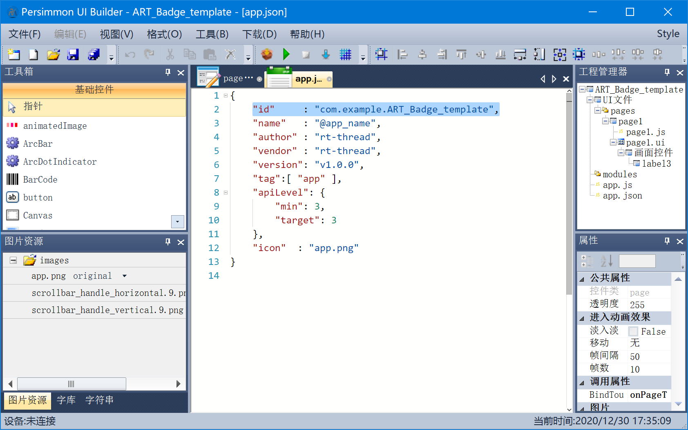

## APP 卸载

APP 卸载需要使用 udb 工具，udb 工具放在柿饼设计器的安装目录下，如果安装时候未修改过安装路径的话，其路径为 `C:\Program Files (x86)\PersimUIBuilder\tools\udb`。

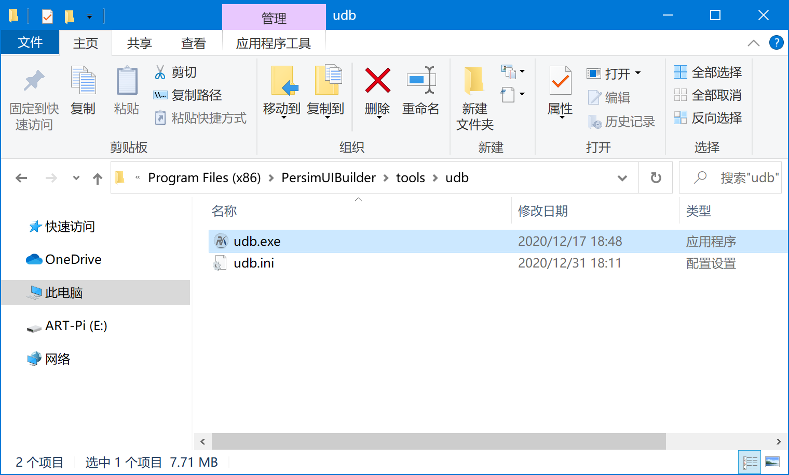

需要将 `udb.exe` 拷贝出来，放到一个无空格无中文的路径下，比如桌面。

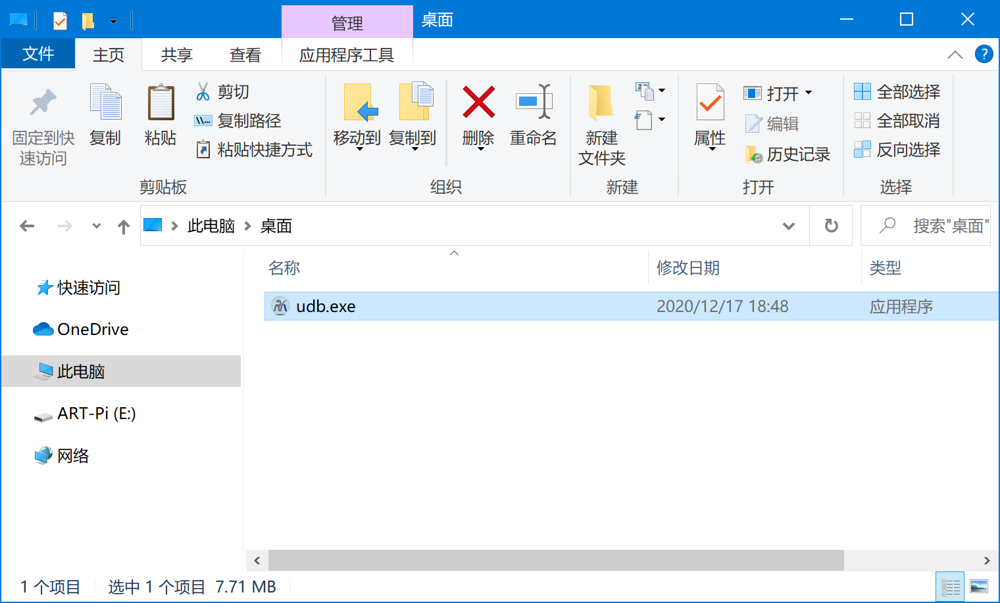

在当前 `udb.exe` 的路径下，打开 Windows Cmd，依次输入如下命令进行连接，同上，`comXX` 是你自己的端口号，打开设备管理器如实填写即可，1000000 是波特率（需要注意，如果从未更新过系统固件，那么波特率为 230400，更新了最新固件后，波特率被修改成 1000000）：

```
udb.exe connect comXX 1000000
udb.exe shell
```


连接成功后，会出现 RT-Thread 启动 logo，如上图所示。后面的操作与平时的 Shell 操作一致。进入到 `/user/apps` 路径下，输入 `ls` 命令可看到已安装 APP 列表，呈现的是以 APP 的 ID 为名字的文件夹。卸载 APP 的命令为 `app_uninstall APP_ID`，如 `app_uninstall com.example.backlight`，回车执行即可。

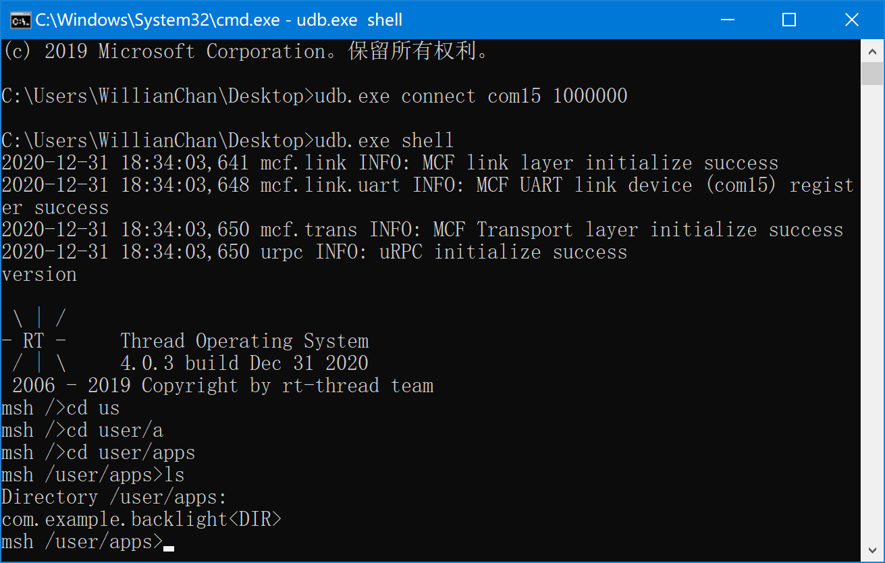

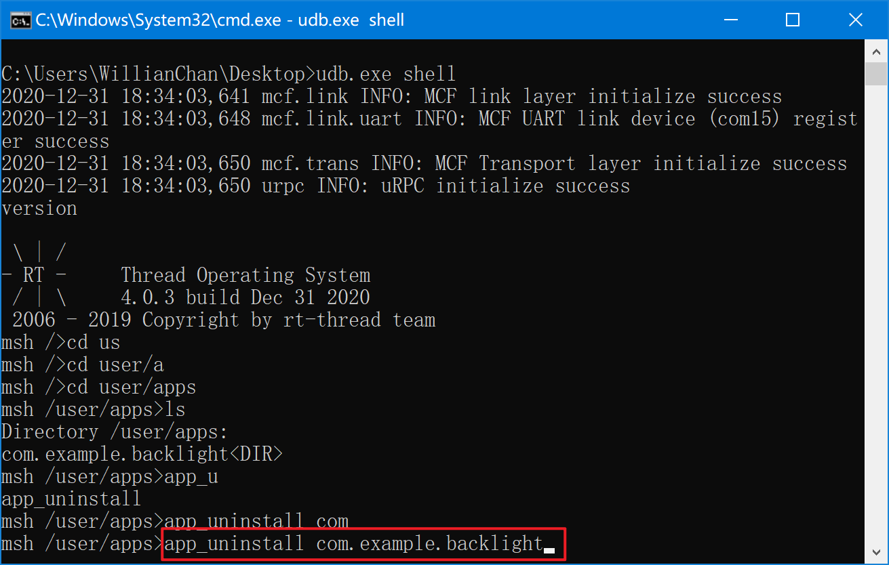

卸载完毕之后，可 `ls` 查看，在 `/user/apps` 路径下，刚刚那个 APP 不见了，表示卸载成功。返回到 ART-Badge 主页重新进入应用列表也找不到被卸载的 APP 了。

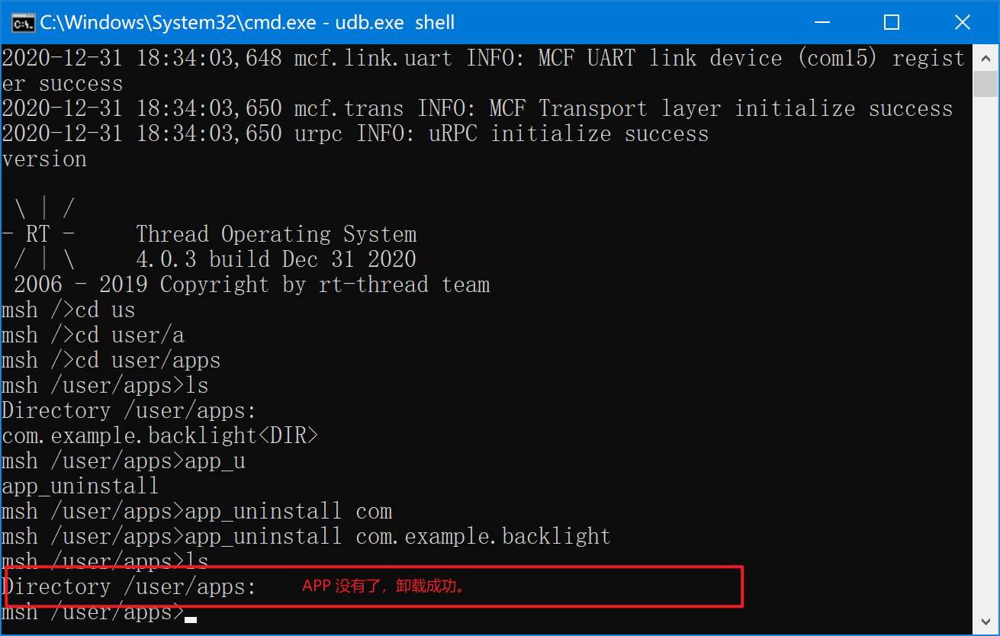

退出 udb 的方式是按 `Ctrl+C`，即可推出。


