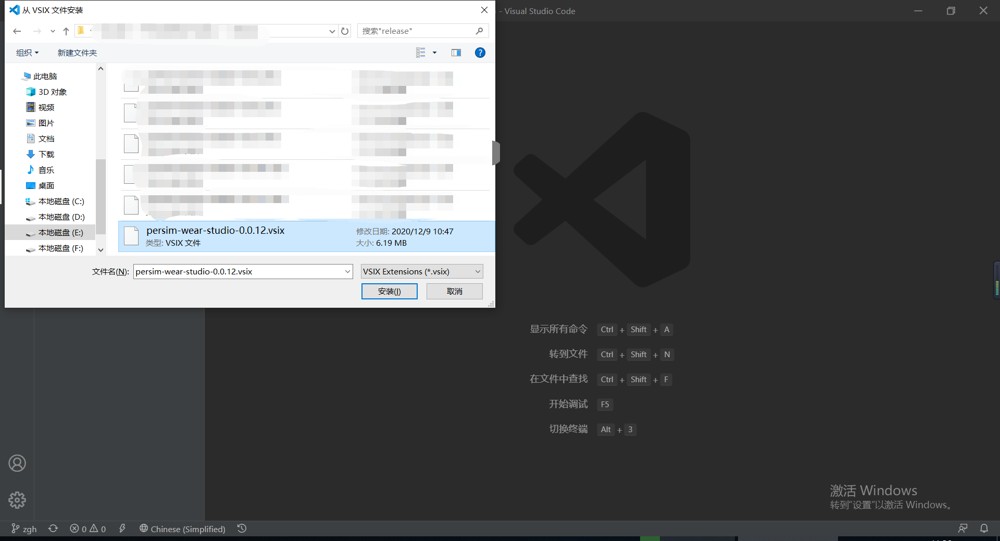

# APP 开发流程

> 该教程适用于使用 Javascript 语言进行 柿饼UI 的应用层面开发。

## Persim Studio 安装使用说明 

Persim Studio 本质上是⼀个 VSCode 插件，他的运⾏依赖于 VSCode 平台。安装使⽤⽅式如下：

### 1.安装 VSCode

安装⽅式可以参考 [VSCode](https://code.visualstudio.com/) 官⽹下载和查看安装说明 。

### 2.安装 Persim Studio 插件

* VSCode 安装完成之后，打开 VSCode 并选择 【扩展】 ⾯板，然后按下图所⽰选择下载好的 PersimStudio 插件⽂件安装即可：

* 点击【从 VSIX 安装...】之后会弹出⼀个选择⽂件的提示窗，选择预先准备好的插件⽂件（后缀为 .vsix 的安装⽂件），点击安装即可：



* 安装完成后，重启 VSCode，可以看到 VSCode 界⾯上多了⼀个 Persim Studio 的快速⼊⼝，同时在【扩展】⾯板的【已安装】列表中出现了 Persim Studio 的名字：

  

* 在【扩展】⾯板的【已安装】列表中点击安装好的 Persim Studio，可以看到更详细的使⽤说明 。

### 3.安装说明

如果插件安装失败请检查 VSCode 的版本，此插件⽀持的版本号 > 1.52.0，且⽬前仅⽀持 windows 操作系统。

## 教程说明

我们将在这个教程中开发一个 Hello Word Demo，在项目中会介绍和使用 `Persim Studio` 的基础知识，边学边做，快速掌握 `Persim Studio` 的开发技巧。

## 项目介绍

1. 项目简介：

   项目包含一个页面，项目打开首先进入开始页面，展示页面有一个 `card` 可以上下轮播滑动进行两张图片的切换。

2. 项目效果演示：

   

   3.项目目录结构

   ```markdown
   Hello_Word:   			// 项目名称
       ├───.settings   	// UI 设计器使用的项目配置文件夹，用来放置配置文件信息
       ├───dist     		// 项目的打包路径
       ├───jsconfig.json   // 实现代码智能提示和自动补全功能的配置文件
       └───src     		// 项目源代码及资源目录
           │   app.js   	// 项目入口文件
           │   app.json    // 项目配置文件，存放项目配置信息
           │   
           |───modules  			// 存放外设驱动的文件夹
           |   ├───hardware.js   	// 外设 js 代码文件
           |   │───touch.js   		// 触摸按键 js 代码文件
           |
           ├───pages  				// 存放页面的文件夹
           │   ├───main   			// main 页面文件夹
           │   │       main.js  	// main 页面 JS 代码文件
           │   │       main.xml   	// main 页面 UI 文件       
           ├───
           └───res   		// 资源文件夹
               ├───images  // 存放图片资源
               ├───values  // 存放各种值映射文件，比如多语言字符串
               └───fonts   // 字体文件夹，存放各种字体文件

## 项目详情

   ### 1. 创建 Hello Word 工程

新建 Hello_word 工程，根据需求选择或者自定义屏幕的分辨率，这个分辨率就是画布的大小，我们这里的分辨率为 240*240，如下图所示：

工程创建好后会自动打开创建的工程。


   ### 2. 拖拽控件

   在左侧的项目目录，双击打开 main.xml 文件，会打开设计器的编辑界面，在编辑器的左上角点击`轮播容器`控件，并拖入编辑区域。


* 接着我们拖拽两个 `图片控件` 到编辑区域，同时设置控件属性，这里我们先将图片的背景清空。


* 点击图片控件的属性，选择资源中的 `demo1.png、demo2.png`作为图片控件的背景


* 修改图片格式为 `rgb565`，来节约资源、提升帧率。


* （可省略）修改 `res/valuses/fonts.xml` 的默认字体为 `youshe` 


### 3. 绑定事件

我们已经实现了一个静态页面，但是没有任何功能，现在给页面绑定一个事件:

- 首先选中页面，将 `右侧属性编辑区` 的 `调用属性` 的 bindtouch 对应的值改成 `onPageTouch`（即给 bindtouch 事件绑定了一个 `onPageTouch` 函数）
- 双击 bindtouch/右键查看代码 ，可自动跳转到 main.js 文件


* 首先添加 moudles 文件夹，moudles 文件夹中包含了触摸按键以及板载硬件的的 API 函数


* 接着在 main.js 文件，page 对象上自动添加了一个 `onPageTouch` 函数，在 `onPageTouch` 函数中进行触摸按键事件的绑定，当执行左—>右滑动作时 ，那么就会退出 app 跳转到 app 列表页面。


### 4. 模拟器运行

- 首先对修改的项目进行保存，然后点击 Persim Studio 左下角的【启动模拟器】按钮，模拟器启动后会首先进入 main 页面


### 5. 添加 APP 图标

* 用户可以选择自己的 APP 图标，将图标存放到本项目的 `\src\res\images` 路径下即可。（为了兼顾美观，建议图标选择 90*90 像素大小）


### 6. 真机运行

* 点击 Persim Studio 左下角的【真机运行】按钮，第一次会弹出配置界面，选择串口调试，对应的端口号以及波特率，下载目录选择 `\user`，然后点击保存，便可以进行真机运行了。


* 在胸牌上的项目展示


## 小程序管理

`PersimWear OS` 中应用软件通常简称为“小程序”，它是由一个 app.js 文件和一个或多个 page 组成及资源文件组成。prc 是小程序的软件包，是将小程序代码，资源打包到一起后的部署文件。

`PersimWear OS` 系统中一般会有一个或者多个小程序。小程序统一由`PersimWear OS`进行管理，`PersimWear OS ` 提供小程序的运行，挂起，切换，退出等操作API。

### 小程序配置

每个小程序有独立的目录，在小程序运行时，每个小程序拥有独立的上下文和独立的资源管理器实例。在不同的小程序下，无法访问到其他小程序的资源文件，只能访问到自己的资源文件。

每个小程序带有一个`app.json`文件，存储当前app的一些配置信息。

```json
 {
    "id"    : "com.example.map", // 小程序唯一 ID
    "name"  : "hello",           // 小程序名称
    "author": "realthread",      // 作者
    "vendor": "realthread",      // 厂家
    "version": "v1.0.0",         // 版本号
    "tag":[ "map", "system" ],   // 标签，用于小程序的分类
    "apiLevel": {                // api 级别
        "min": 2, 
        "target": 2
    },
    "icon"  : "app.png"          //小程序图标，需存放在 res/images 目录下
}
```

**注意事项**

小程序 ID 需要确保在`PersimWear OS`中的唯一性，不要和当前系统中已有的小程序重复。如果手动安装小程序，安装目录必须和小程序ID一致。

### 安装

小程序安装后的文件包含`app.prc`，`app.json`，`icon.png`三个文件。安装后的目录结构如下：

```json
hello      		   // hello小程序安装目录
├── app.prc        // 小程序发布部署文件，通过设计器打包获得
├── app.json       // 小程序配置文件
└── icon.png       // 小程序图标，名称不固定，跟app.json中icon配置对应
```

安装时需要在安装目录下新建一个与小程序id相同的目录，将生成的`app.prc`以及项目里的 `app.json`和`icon.png`(名字不固定)三个文件拷贝到新建的文件夹中即可完成安装。

> 安装目录指的是 `/system/apps`和 `/user/apps`中的一个，具体根据用户需要选择。

### 卸载（需升级固件）

使用 udb 连接到设备，执行 `udb uninstall com.example.app1`  命令，最后一个参数为应用程序的 ID。


**注意事项** 目前安装或卸载完后，需要重新启动才可以刷新小程序列表。

> 目前出厂固件暂不支持卸载命令卸载小程序，需要提前进行固件升级，方可使用。

