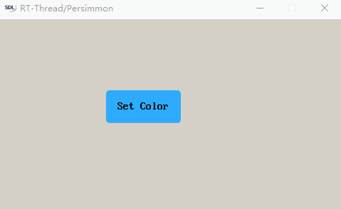

# Page & this

## onLoad(event)

在创建 Page 对象完成后，系统会自动调用此接口，用于初始化 Page，Page 页面的入口。比如加载某些资源、自定义面板、接收下文代码中 value 的数据等。与 onExit 成对出现。


| 参数  | 类型                   | 描述                                        |
|-------|------------------------|---------------------------------------------|
| event | Number/String/Object等 | navigateTo/redirectTo 的入参的 `value` 属性 |

```JavaScript
/* page1跳转到page2时的跳转代码，并传递了page2中onLoad函数需要接收的数据 */
pm.navigateTo({url : 'page2/page2', value : 123})               // page2 的 onLoad 函数内接收的值为 123
pm.redirectTo({url : 'page2/page2', value : {abc:"123456"}})    // page2 的 onLoad 函数内接收的值为 {abc:"123456"}

/* page2 onLoad 函数接收page1 传来的数据 */
onLoad: function (event) {
    console.log(event)
} // 输出 '123' 
```

## onResume()

Page 第一次显示完成之后，会调用该方法。主要用于延后加载某些和底层交互有关的数据，以及其他资源等。

注：该接口的目的是避免因为要等待加载某些资源而影响界面刷新。比如界面需要显示温度，而温度需要通过串口或其他较为复杂的外设读取，假如读取这些数据要花很多时间，这个时候如果一直等待数据的话势必会影响界面的加载时间，造成卡顿。此时可以用此接口以保证界面优先刷新出来，同时可以采用其他策略，比如用之前数据缓存来保证数据显示等

## onHide()

页面变更为隐藏状态时执行。与 onShow 是成对出现的。

`* 页面每隐藏一次就会触发一次。比如打开 page1 跳转到 page2 时触发一次，由 page2 返回到 page1 再进入其他页面也会触发一次。如果关闭的 page 是非当前页面，则不会触发，因为它已经触发过 onHide。例如在 page2 里面关闭 page1，只会触发 page1 的 onExit 函数`

假设有这么一个场景：系统底层有一个线程要一直读取某传感器的数据用于page1上曲线图的显示，这个线程对cpu的占用会比较高。此时，用户从page1切换到了page2，然后做了某些事情再切回page1。在切到page2后，此时page1的曲线图已经不需要显示了，如果底层采集数据的线程一直运行着势必会影响到page2的界面效果。此时可采调用`onHide()`方法，通知底层挂起数据采集的线程，等到再切回page1的时候，通过`onLoad()`或者`onShow()`方法启用该线程

## onShow()

页面变更为显示状态时，会调用该函数。与 onHide 是成对出现的，与页面显示相关的功能。参考 onHide() 介绍的场景

`* 页面每显示一次就会触发一次。比如打开 page1 时触发一次，跳转到 page2 后，由 page2 返回到 page1 也会触发一次。`

## onExit()

Page 关闭时触发，对象销毁前会调用该方法，主要用于当前 page 对象内资源的回收。比如定时器的销毁和已注册事件回调方法的移除等。与 onLoad 成对出现。

## onUpdate(event)

有以下 2 中情况，将触发 onUpdate：

1. 接收 `App` 传递数据，即在 app.js 中调用 app 对象的 onUpdate 函数后触发。对应 app 文档中的 [app.onUpdate](app-dev/references/apis/js-fwk/app/app.md#onupdate)，详见下文代码中¹。
2. 相关 page 关闭返回到当前 page，并返回相关 page 中的参数，即相关 page 中调用 pm.naviagetBack 后触发。

```js
pm.navigateBack(value)
pm.navigateBack(value，number)
```

| 参数  | 类型                   | 描述                    |
|-------|------------------------|-------------------------|
| event | Number/String/Object 等 | 返回前页的 onUpdate 函数入参 value |

```js
/* ===== page1 Code -- START ===== */

/* 在 page1 拖入一个 button 控件，
 * 设置文本为：Set Color
 * 并设置调用属性名称为 click
 */

var page = {
    click: function (event) {
        pm.navigateTo('page2/page2');
    },

    onUpdate: function (event) {

        /* ¹⁻¹
           在代码任意函数内调用 app.onUpdate({ key : value }) 函数。
           本页面代码内存在 onUpdate 函数，则会被触发，且传入参数为 { key : value }。
        */

        console.log(event) // 打印出 page2 关闭时回传的参数
        /* 根据参数值设置背景色 */
        this.setData({ bufferPage: { background: (event ? 0xffff0000 : 0xff0000ff) } })
    }
};
Page(page);
page = 0;
/* ===== page1 Code -- End ===== */

/* ===== page2 Code -- START ===== */

/* 在 page2 拖入两个 button 控件，
 * button1 的文本为：Red，button2 的文本为：Blue
 * 并设置它们的调用属性名称为 click
 */

var page = {
    /* button1 button2 共同调用该函数 */
    onClick: function(event){
        /* 判断被点击的 button id 信息 */
        pm.navigateBack(event.target.id == 'button1')
    },

    /* ¹⁻²
        在代码任意函数内调用 app.onUpdate({ key : value }) 函数。
       本页面代码内不存在 onUpdate 函数，则不会被触发，无对应操作。
    */

};
Page(page);
page = 0;
/* ===== page2 Code -- End ===== */
```

### 效果




## setData

控件属性配置接口，详细说明见[setData文档](app-dev/references/widgets/Page/Page.md#setdata-功能)。

## page.js 内的全局变量

 与当前页 page 变量同级的变量会被创建为全局变量。

 一般的全局变量定义在 app.js 内，在 page 文件中定义会不可控且造成内存泄漏，因为每次进入该页面加载 js 文件时，会去创建一个新的全局变量到内存中，上次进入该页面创建的该变量就会失去控制，一直存在于内存中，进而导致内存泄漏。

 具体见下文示例。

### 示例代码

```JavaScript
/* GLOBALVARIATE 与 page 同级，故 GLOBALVARIATE 是全局变量 
   每次进入该页面就会创建一个 GLOBALVARIATE ，上一次创建的该对象已丢失，造成内存泄漏。故应避免在 page.js 内创建全局变量。如果需要的话，在 app.js 内创建
   */
var GLOBALVARIATE = {
    Name:'PersimmonUI',
    Company: 'RTT'
}

var page = {
    /* 此方法在第一次显示窗体前发生 */
    onLoad: function (event) {
        console.log('onLoad');
    },

    /* 此方法展示窗体后发生 */
    onResume: function (event) {
        console.log('onResume');
    },

    /* 当前页状态变化为显示时触发 */
    onShow: function (event) {
        console.log('onShow');
    },

    /* 当前页状态变化为隐藏时触发 */
    onHide: function (event) {
        console.log('onHide');
    },

    /* 此方法关闭窗体前发生 */
    onExit: function (event) {
        console.log('onExit');
    },

    onUpdate: function (event) {
        console.log('onUpdate');
    }
};
Page(page);
page = 0;
```

# this

## 整体认识

`this`是JS语言中的一个关键字，用于指代当前的引用对象，this只能在运行期才能决定，指向最终发起调用时关联的对象。所以在用`this`的时候，一定要搞清楚它到底在指代谁

在柿饼UI中，通常在 `page.js` 中都有一个 `var page{}` 对象，而常用情况下 `this` 指代 `page{}` 整个对象。因此，可以通过 `this` 关键字访问或者重新设置 `page{}` 内的属性值。下面我们通过几个简单的例子，来给大家讲讲怎么分析 `this` 到底指代谁

## 实例分析

### 先理解作用域

* 代码示例一

```javascript
var page = {
    onLoad: function (event) {
        sayHello()
    }
};

Page(page);
page = 0;
```
这段代码的执行结果如下所示，很显然，我们没有定义sayHello()函数，执行当然出错

```
[E/JERRY UTIL] Script Error: ReferenceError: sayHello is not defined
[E/JS_OBJECT] Function [ onLoad ] calling error!
```

* 代码示例二

```javascript
var page = {
    onLoad: function (event) {
        function sayHello(){
        console.log('Hello from onLoad!')
        }
        sayHello()
    }
};

Page(page);
page = 0;
```
这段代码的执行结果如下所示，我们在onLoad方法内定义了sayHello()函数，代码可以正常执行

```
"Hello from onLoad!"
```

* 代码示例三

```javascript
function sayHello(){
    console.log('Hello from Global!')
}

var page = {
    onLoad: function (event) {
        function sayHello(){
        console.log('Hello from onLoad!')
        }
        sayHello()
    }
};

Page(page);
page = 0;
```
这段代码的执行结果如下所示，我们在onLoad方法内定义了sayHello()函数，有在page对象外定义了一个全局的函数sayHello(),发现执行的结果还是onLoad方法内定义的函数sayHello()

```
"Hello from onLoad!"
```

* 代码示例四

```javascript
function sayHello(){
    console.log('Hello from Global!')
}

var page = {
    onLoad: function (event) {
        // function sayHello(){
        // console.log('Hello from onLoad!')
        // }
        sayHello()
    }
};

Page(page);
page = 0;
```
如果我们把onLoad方法内的sayHello()函数注释掉，结果是什么样子的呢？结果如下，发现他去执行全局变量sayHello()函数了。

```
"Hello from Global!"
```

* 代码示例五

```javascript
function sayHello(){
    console.log('Hello from Global!')
}

var page = {

    /* 此处 sayHello 方法是page的属性，和每个控件的回调函数等同 */
    sayHello: function (){
        console.log('Hello from Page!')
    },
    onLoad: function (event) {
        // function sayHello(){
        // console.log('Hello from onLoad!')
        // }
        sayHello()
    }
};

Page(page);
page = 0;
```
如果我们把onLoad方法内的sayHello()函数注释掉，然后再在page对象内部定义一个sayHello方法，结果又是什么样子的呢？结果如下，发现他还是去执行全局变量sayHello()函数了。

```
"Hello from Global!"
```

* 代码示例六

```javascript
// function sayHello(){
//     console.log('Hello from Global!')
// }

var page = {

    /* 此处 sayHello 方法是page的属性，和每个控件的回调函数等同 */
    sayHello: function (){
        console.log('Hello from Page!')
    },
    onLoad: function (event) {
        // function sayHello(){
        // console.log('Hello from onLoad!')
        // }
        sayHello()
    }
};

Page(page);
page = 0;
```
如果我们把onLoad方法内的sayHello()函数和全局变量sayHello()函数都注释掉，然后再在page对象内部定义一个sayHello方法，结果又是什么样子的呢？结果如下，它找不到sayHello()函数定义，也不会去执行page对象内部的sayHello方法。

```
[E/JERRY UTIL] Script Error: ReferenceError: sayHello is not defined
[E/JS_OBJECT] Function [ onLoad ] calling error!
```

* 小结

通过上面六个代码示例，我们可以总结出js代码的作用域顺序

` 对象内的方法(如onLoad)会先在函数内部寻找变量定义(函数体内定义的sayHello)；如果找不到，它会跳出对象本身(结合代码示例六)，去到全局变量中寻找定义(全局定义的sayHello)；如果都找不到，我们参看代码示例一，会报错，提示未定义；再结合代码示例六，即便对象本身定义了sayHello方法，它也不会去使用`

### 进入 this

* 代码示例七

```javascript
function sayHello(){
    console.log('Hello from Global!')
}

var page = {

    /* 此处 sayHello 方法是page的属性，和每个控件的回调函数等同 */
    sayHello: function (){
        console.log('Hello from Page!')
    },
    onLoad: function (event) {
        function sayHello(){
        console.log('Hello from onLoad!')
        }
        this.sayHello()
    }
};

Page(page);
page = 0;
```
我们在调用sayHello()函数前，加上`this.` 执行结果就变成了如下调用page的sayHello方法属性了，是不是很神奇

这里`this`本身指代page对象，`.`代表`取`对象的属性。所以此处的结果与sayHello()函数是否定义、在哪里定义无关。因此，如果我们要用到page对象的某些属性的时候，就需要用`this.`来取了。
```
"Hello from Page!"
```

* 代码示例八

```javascript
var page = {

    /* 此处再给page对象定义一个num 属性 */
    num: 123,

    /* 此处 sayHello 方法是page的属性，和每个控件的回调函数等同 */
    sayHello: function (){
        /* 按照代码示例七的理解，调用page的num属性 */
        console.log('Page.num: ' + this.num)
        console.log('Hello from Page!')
    },

    onLoad: function (event) {
        this.sayHello()
    }
};

Page(page);
page = 0;
```
我们对之前的代码进行精简，在sayHello方法内调用page的num属性，结果如下，说明我们的理解还是不错的
```
"Page.num: 123"
"Hello from Page!"
```

* 代码示例九

```javascript
var page = {

    /* 此处再给page对象定义一个num 属性 */
    num: 123,

    /* 此处 sayHello 方法是page的属性，和每个控件的回调函数等同 */
    sayHello: function (){

        /* 此处还按代码示例七的理解做如下改动 */
        function showNum(){
            console.log('Page.num: ' + this.num)
        }
        showNum()
        console.log('Hello from Page!')
    },

    onLoad: function (event) {
        this.sayHello()
    }
};

Page(page);
page = 0;
```
执行结果居然出现了 `undefined`，那么按代码示例七的理解，我们明明还是用`this.`来调用page的num属性啊，哪里出问题了？
```
"Page.num: undefined"
"Hello from Page!"
```

***

`还记得刚开始讲this时提到的，this会随着程序执行上下文切换而随时转变吗？怎么变，变成什么了？下面我们通过加一些调试代码详细看看`

* 代码示例十

```javascript
var page = {

    /* 此处再给page对象定义一个num 属性 */
    num: 123,

    /* 此处 sayHello 方法是page的属性，和每个控件的回调函数等同 */
    sayHello: function (){

        console.dir(this) //打印此时this的属性

        /* 此处还按代码示例七的理解做如下改动 */
        function showNum(){

            console.dir(this) //打印此时函数体内this的属性

            console.log('Page.num: ' + this.num)
        }
        showNum()
        console.log('Hello from Page!')
    },

    onLoad: function (event) {
        this.sayHello()
    }
};

Page(page);
page = 0;
```
```
"Hello from Page!"

{num : 123.000000, sayHello : [function], onLoad : [function], setData : [function], getData : [function], getMouseOwner : [function], requestAnimationFrame : [function]}

{print : [function], console : {log : [function], dir : [function]}, module : {exports : {}}, require : [function], unrequire : [function], Buffer : [function], Event : [function], Message : [function], FPS_CPU_ENABLE : [function], FPS_CPU_GET : [function], PM_REQUEST : [function], PM_REQUEST_GET : [function], __dirname : "/", __filename : "/app.js", requestAnimationFrame : [function], setTimeout : [function], setInterval : [function], clearTimeout : [function], clearInterval : [function], pm : {getFileSystemManager : [function], appUninstall : [function], setStorage : [function], setStorageSync : [function], getStorage : [function], getStorageSync : [function], getStorageInfo : [function], getStorageInfoSync : [function], removeStorage : [function], removeStorageSync : [function], clearStorage : [function], clearStorageSync : [function], createCanvasContext : [function], navigateTo : [function], redirectTo : [function], navigateBack : [function], closePage : [function], getPages : [function], getCurrentPages : [function], getPageName : [function], getPagesName : [function], getPageObject : [function], keyboard : [function], getSystemInfo : [function], getSystemInfoSync : [function], averageFps : [function], frameGenTime : [function], version : [function], openSerialPort : [function], request : [function], createAnimation : [function], createAnimator : [function], clock : [function], microClock : [function], createAudioContext : [function], downloadFile : [function], untar : [function], appInstall : [function], openIICPort : [function], createWifi : [function], createVideoContext : [function], loadImage : [function], freetypeCache : [function], tr : [function], loadTranslateFile : [function], load : [function]}, App : [function], AppSwitch : [function], AppExit : [function], GetApp : [function], Page : [function], PageScriptParse : [function], PageScriptRelease : [function], XMLParse : [function], XMLRelease : [function], app : {page : "page1/page1", onLaunch : [function], onExit : [function], onUpdate : [function], setData : [function]}, page : 0.000000, sayHello : [function]}

"Page.num: undefined"
```
大家看到了吧，`this`的指代对象确实发生了改变，刚进sayHello方法时，`this`指代的还是`page`对象，并清晰地看到，page的`num`属性；但是进showNum()函数体内的时候，`this`却指向了`全局对象`，`全局对象`里面确实没有找到num，所以返回了 `"Page.num: undefined" `

***

`那这个时候我们该怎么办呢？`

* 代码示例十一

```javascript
var page = {

    /* 此处再给page对象定义一个num 属性 */
    num: 123,

    /* 此处 sayHello 方法是page的属性，和每个控件的回调函数等同 */
    sayHello: function (){

        var that = this //将此时指代page对象的this保存在变量that内，变量that不会随上下文改变

        /* 此处还按代码示例七的理解做如下改动 */
        function showNum(){
            console.log('Page.num: ' + that.num) //此时用指代page对象的that来调用num属性
        }
        showNum()
        console.log('Hello from Page!')
    },

    onLoad: function (event) {
        this.sayHello()
    }
};

Page(page);
page = 0;
```

我们将指代page对象`时刻`的`this`，用变量`that`保存，然后在需要用的地方用 `that.xxx`来调用`page`的某些属性。当然，这个变量名可以随便起，此处遵循小程序用法惯例，使用`that`

```
"Page.num: 123"
"Hello from Page!"
```

### 小结

相信聪明的你把上面的示例看完，最好能亲自做一遍，应该能完全掌握这个`令人烦恼而又简单的` this 了吧