# Launcher 开发流程

## 设计器导入 Launcher 工程

打开柿饼设计器，在设计器中打开 Launcher 工程进行修改二次开发即可，`ART-Badge_launcher` 文件夹里的就是 Launcher 的柿饼源码。

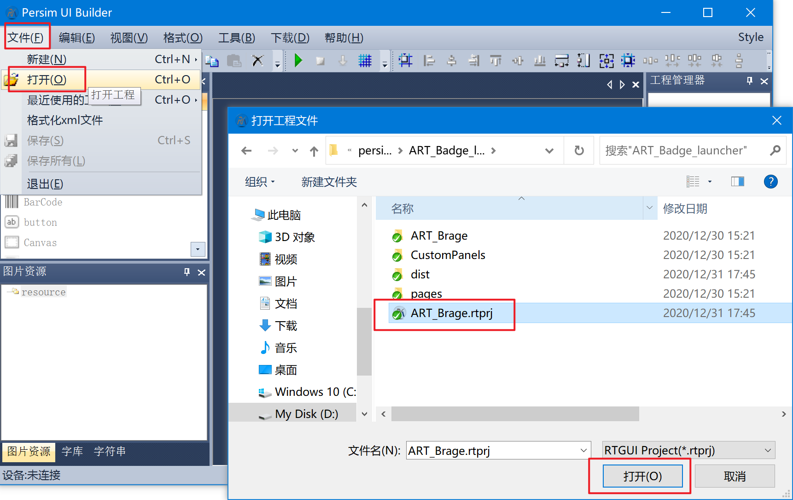

## 打包 Launcher 为 prc 文件

二次开发完毕之后，在设计器中点击 `打包` 按键就可以一键打包成 prc 文件，如下图所示。

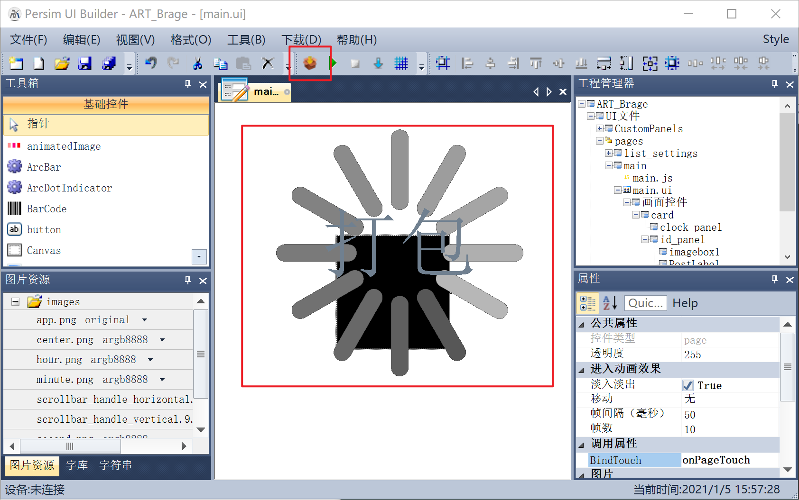

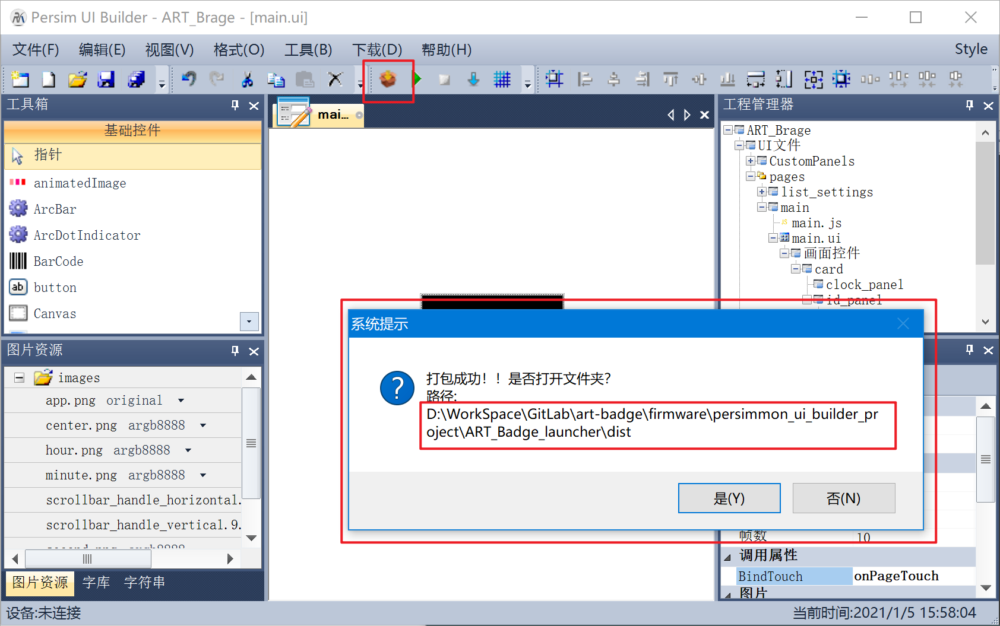

弹出的提示中的路径就是打包生成的 prc 文件的所在路径了。

## 根文件系统打包脚本使用方法

Launcher 打包出来的固件是需要放在根文件系统下运行的，故需要把打包出来的 Launcher 的 app.prc 文件打包进根文件系统中，即需要生成 root.bin 文件。

生成 root.bin 文件需要使用一个脚本工具 `persim_mkromfs_script.zip`，该工具需要依赖 Python 3，故请到Python 官网下载：https://www.python.org/downloads/ 。安装 Python 3 的时候需要特别注意，需将其添加到 Windows 的环境变量中来，如下图所示。若安装时忘记勾选，请自行百度安装后添加环境变量的方法。

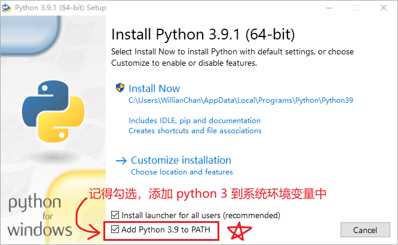

解压 `persim_mkromfs_script.zip`，把 `root.zip` 根文件解压在 `...\persim_mkromfs_script` 文件夹里面，`root` 的文件夹解构如下：

```
root
├─system
│  ├─apps
│  │  └─launcher
│  ├─cfg
│  ├─db
│  ├─fonts
│  ├─icons
│  └─lib
│      └─js
└─user
```

把刚刚设计器中生成的 launcher 的 app.prc 文件拷贝到 `...\persim_mkromfs_script\root\system\apps\launcher` 路径下，返回到 `...\persim_mkromfs_script`，双击 `mkromfs.bat` 运行，与其同级目录下可见生成了 `root.bin`。

## 添加出厂自带程序（可省略）

这就像你买了新手机，手机的 Launcher 中是可以看到一些默认出厂程序的，比如相机、相册、通讯录、文件管理器、电话、信息和浏览器等。湃心 OS 也是可以在 Launcher 中夹带小程序的，作为出厂自带程序；同理，出厂自带程序是需要和 Launcher 一样放在根文件中的。当然，不添加出厂自带程序也是没问题的，这些小程序可以后期再下载到板子上也行，所以这一步可省略。

这里以 `蓝牙助手` 为例。首先，设计器中打开 `ART-Badge_ble`，打开 `app.json` 文件，找到该小程序的 id，如下图所示，`蓝牙助手` 小程序的 id 是`com.example.ART_Badge_ble`。小程序 id 是可以自行修改的，但需要确保在湃心 OS 中的唯一性，不要和当前系统中已有的小程序重复。


回到 `...\persim_mkromfs_script\root\system\apps`  目录下，用小程序的 id 为名字新建一个文件夹，`蓝牙助手` 小程序打包生成 app.prc 文件之后，在打包文件目录下找到 `app.prc` 和 `app.json` 这两个文件，复制到刚刚新建的以小程序 id 为名的文件夹中。最后还有一个 `app.png` 也需要拷贝进来，作为小程序的图标用，目前的 Launcher 中最大支持 92 × 92 大小的图标。`app.png` 可以自行提供，也可以使用默认图标，默认图标在 `...\ART_Badge_ble\ART_Badge_ble\res\images` 路径下。所以一共是三个文件：app.prc、app.json、app.png。

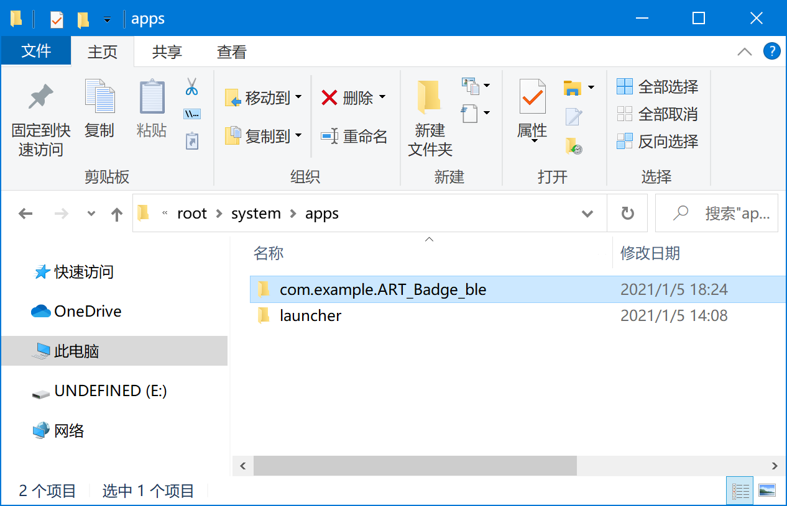

最后需要重新打包一个 `root.bin` 文件出来，方法同上 `根文件系统打包脚本使用方法`，不再赘述。

## 下载 Launcher 固件

> 下载 Launcher 后想立马运行起来看到效果，需要保证板子已经有系统了，否则下进去后啥也看不见。

下载 Launcher 固件需要使用 MPTool 工具。

使用之前需要先注册，在 `..\Bee2MPTool_kits_v1.0.4.0\Registry Set` 里找到 `RegistrySet.exe`，双击执行即可（不会有任何提示，双击就可以了）；如果提示错误，请阅读该目录下的 `ReadMe.txt` 文档解决。

打开 MPTool 工具之后，需切换到 `调试` 模式，见下图指示。

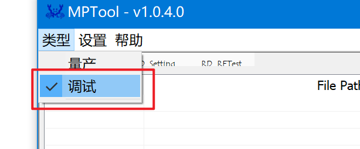

把 `Image Files` 取消勾选，把 `User Data` 勾选上，点击 `User Data` 按键选择之前生成的 `root.bin` 固件，见下图指示。

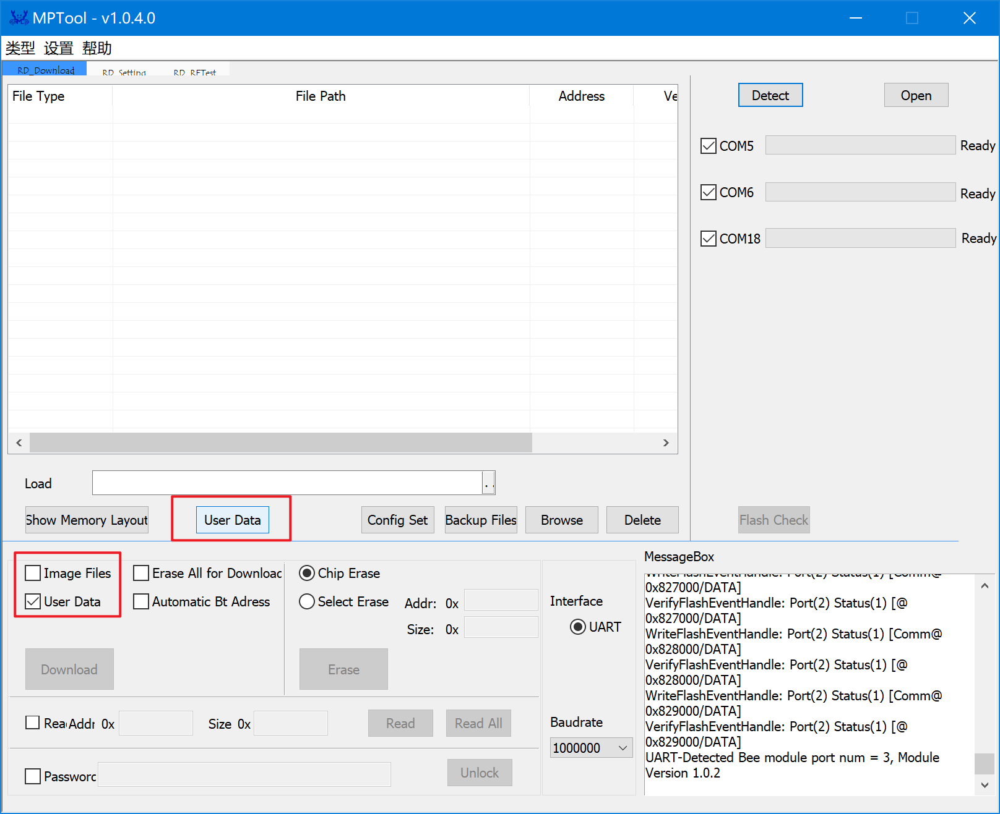

Address 需要更改为 0x00C00000。

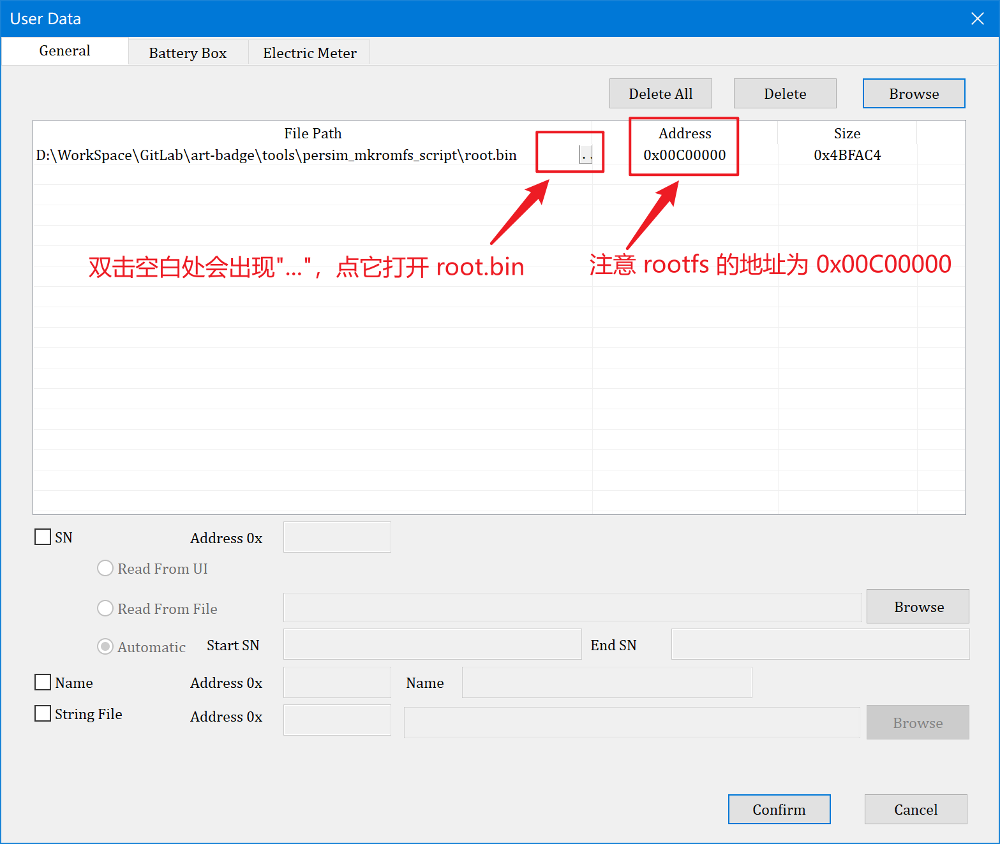

ART-Badge 胸牌与电脑连接，按下内键（即 `LOG_UART_TX` 键）不放（是为了拉低 P0_3 引脚），按一下外键（即 `RESET` 键）复位 MCU，此时内键依旧不放，MPTool 工具中点一下 `Detect` 和 `Open`，发现有一个 COM 口显示 OK，就可以松开内键了。如下图所示。

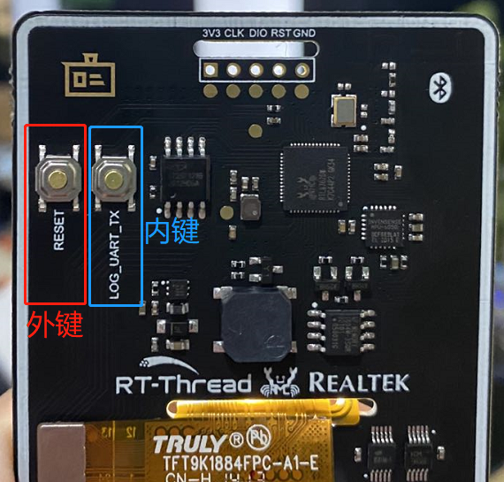

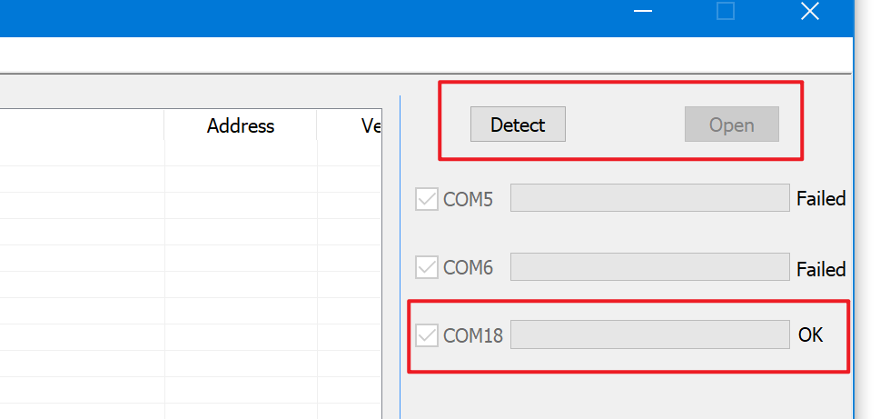

建议波特率选择 1000000，比较稳定些，最后点击 `Download` 按键即可下载 Launcher 固件了。如果遇到下载失败的情况，建议重复上述步骤多试几次，同时尝试降低波特率。Good Luck。

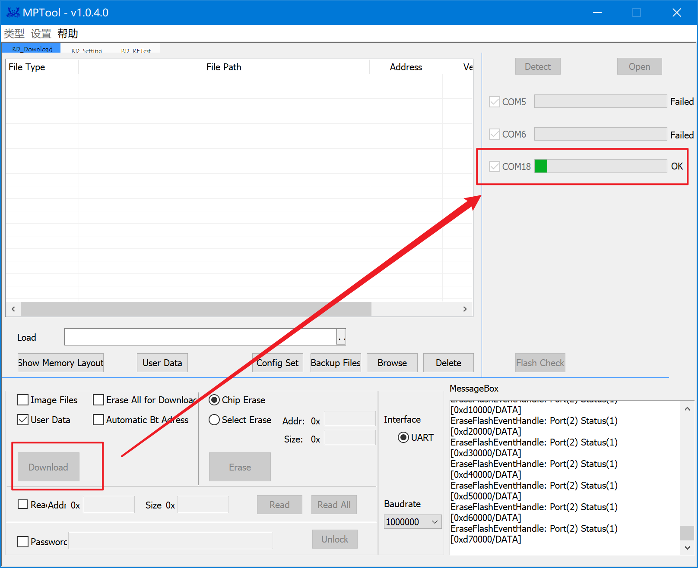

下载成功之后，开机显示 `湃心 OS PersimWear` LOGO，并进入 Launcher 界面，恭喜，跑起来了，Have Fun~


## 其他

如果 MPTool 工具使用上需要问题，请打开文档 `\Bee2MPTool_kits_v1.0.4.0\Doc\MP Tool User Guide CN.pdf`，内有 Realtek 官方详细使用教程与问题解决方法。