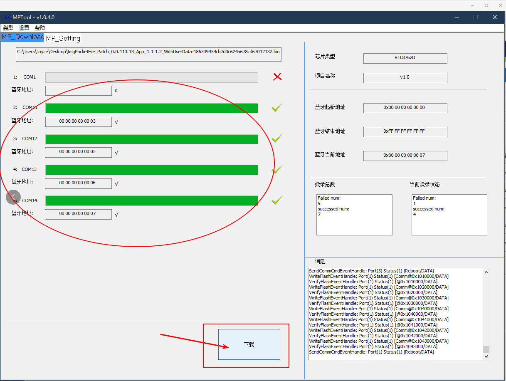

# 老版本胸牌指南

* 为了向下兼容老版电子胸牌，我们推出了兼容老版本的固件。请按照以下流程烧录，方可同步最新固件以及使用新版本设计器。

> 拥有 2021 最新版电子胸牌的同学可以选择跳过该教程。

## 选择兼容固件

首先找到固件的文件目录，将该目录进行拷贝，方便后续步骤使用。

## 配置 MPTool 工具

> MPTool 工具设置一次即可，后面无论是电脑重启或重新打开该工具均可保持上一次的设置。

双击 MPTool.exe 打开该工具，选择芯片类型为 `RTL8762D`。

在菜单栏中，选择类型为量产即可。

在 MP_Setting 中导入待下载的 xxx.bin 文件。进入 MP_Setting 页面，该界面呈灰色，因为需要先登录。

先点击右下角的 `解锁` 按钮，设置密码如 “123”，登录即可。

登陆之后，该页面数据框变为可编辑：

1. 项目名称，随意填写。
2. 包文件：点击图中的 `...`，将 xxx.bin 文件加进来。
3. 设置蓝牙起始地址、蓝牙结束地址，建议蓝牙起始地址为：4C ED FB XX XX XX，其中 XX XX XX 可以自定义。（都是16进制）。
4. 点击锁定，界面变为不可编辑状态，MPTool 设置完成。

## 开始下载固件

MPTool 工具设置完成后，进入 MP_Download 界面，如下图所示：

* ART-Badge 使用 USB线 与电脑连接，先按下内键（即 `LOG_UART_TX` 键）不放，然后按一下外键（即 `RESET` 键）复位 MCU，最后松开内键即可。

所有连在电脑上的线路板都操作完成了之后，点击 `下载` 即可：可以看到电路板的下载进度，进度条满，显示绿色打钩后，该组 ART-Badge 固件下载结束。

下载成功之后，开机会显示 `湃心 OS PersimWear` LOGO ↓↓，并进入 Launcher 界面，至此说明你的固件已经更新成功。

## 注意事项

1、一组设备下载全部结束后，才可以插拔设备。

2、如果出现 MPTool 工具下载过程中无响应，可能是数据线有问题，更换一条 usb 线。

